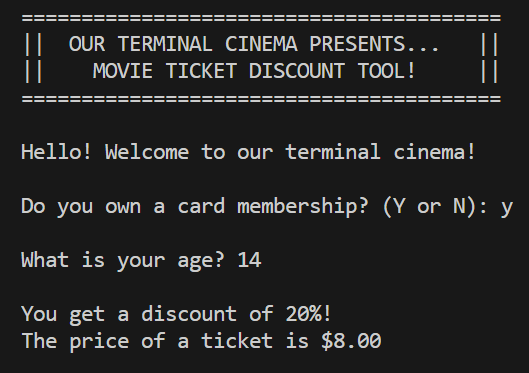

  

# 🎟️ Project 4 – Movie Ticket Discount Tool (in C)

This is **Project 4** in a series of mini exercises for **beginners learning C programming**. Each project in the series helps you practice essential programming concepts such as variables, conditionals, formatted output, logic flow, and working with external files.

🔍 **What this project adds to your learning:**

- ✅ Use of multiple `bool` flags for logic branching  
- 🧾 Nested `if` / `else` conditionals  
- 🧮 Calculating cumulative percentage-based discounts  
- 📂 Reading from an external file using `fopen()`, `fgets()`, and `fclose()`  
- 🎨 Displaying styled ASCII art from a `.txt` file  

---

## 📌 About this project

This mini project is a **Movie Ticket Discount Tool**, designed to simulate a terminal-based ticketing system that calculates and applies discounts based on user input.

When the program is run, it:

- Displays a styled ASCII banner (read from a `.txt` file)
- Asks if the user holds a **membership card** (Y/N)
- Asks the **user's age**
- Applies relevant discounts depending on age and membership
- Calculates and displays the final ticket price

---

## 🖥️ Example Output

Two sample runs are shown below:

- Without any discount  
  

- With combined discounts  
  

---

## 📘 ASCII Banner

This project also demonstrates reading from an external file and displaying a custom **ASCII banner** at program startup.

📁 File path:  
`src/ascii_art.txt`

---

## 🧠 Challenge Instructions

If you’d like to practice building this project yourself before reviewing the solution, follow these steps:

1. Display a custom ASCII banner from a text file using `fopen()`, `fgets()`, and `fclose()`.
2. Prompt the user to confirm if they have a **membership card** (Y/N).
3. Ask the user for their **age**.
4. Based on the input:
    - 💳 Card members: get 10% off  
    - 👶 Students (under 18): get 10% off  
    - 🧓 Seniors (65+): get 20% off  
    - 💡 Multiple discounts can apply (e.g. member + senior = 30% max)
    - ❌ No discount if none of the above apply
5. Calculate the final ticket price with a max total discount of **30%**.
6. Print the result clearly with 2 decimal places.

> **Note:** This project is already complete and includes the full solution. You can explore the code in `main.c`, the ASCII banner in `src/ascii_art.txt`, and the output samples in the `img/` folder.

Happy coding! 🍿🎬

